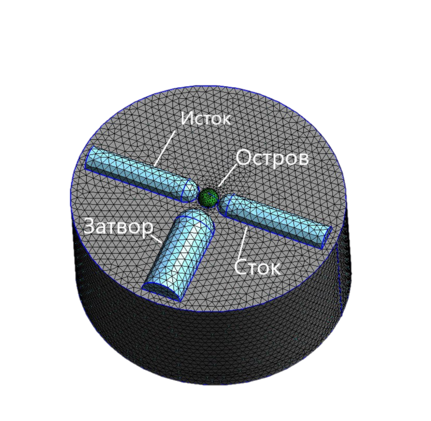
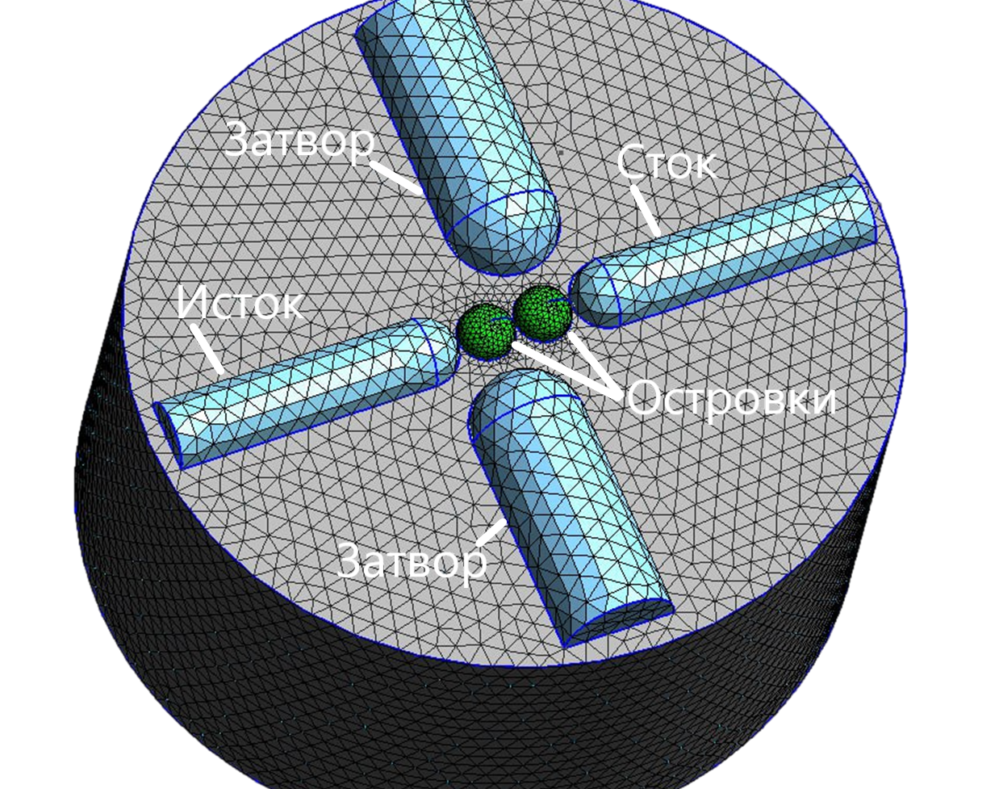
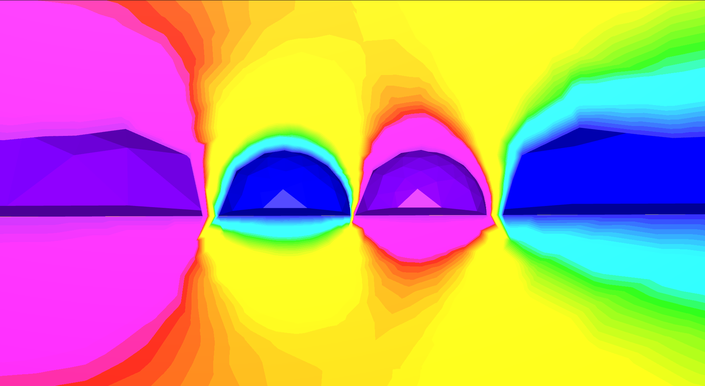
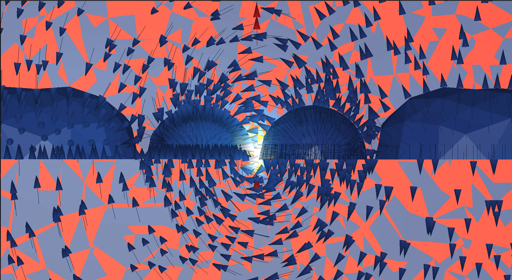
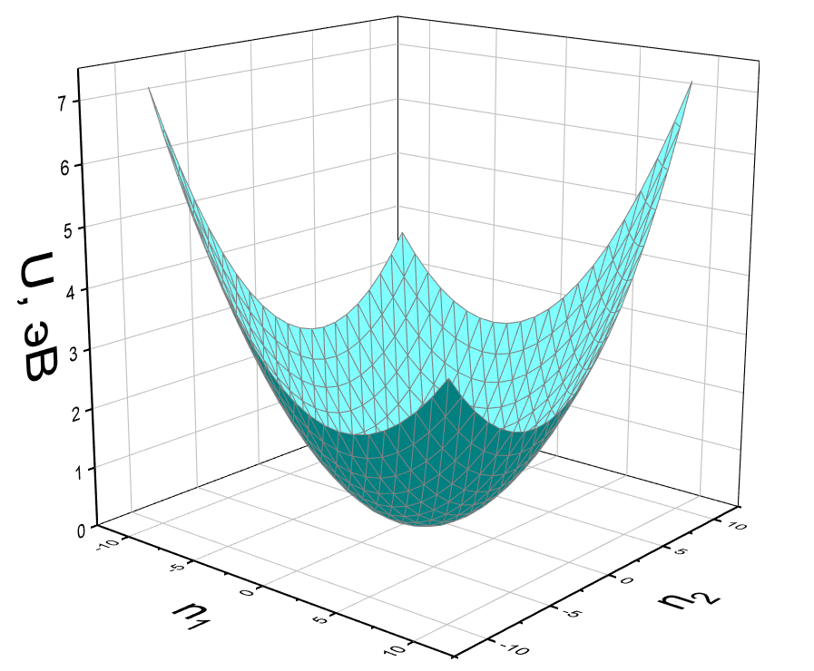

<h1 align="center">Расчет емкостных параметров для одноэлектронных систем с большим
количеством островов и электродов</h1>

<div align="center">

[](https://github.com/GIScience/badges#archive)

</div>

---

## Оглавление

- [Актуальность](#relevance)
- [Цели](#goals)
- [Теоретическое введение](#theory)
- [Реализация](#realisation)
- [Запуск](#launch)
- [Примеры](#examples)
- [Заключение](#conclusion)
- [Литература](#literature)

## Актуальность <a name = "relevance"></a>

В элементах полупроводниковых квантовых компьютеров с большим числом кубитов необходимо большое число туннельных и управляющих электродов, а также большое количество островков. Причём, изменение взаимного расположения этих элементов координально меняет транспортные, зарядовые, спиновые и временные характеристики устройства, а также влияет на качество его работы. Так как изготовление реальных образцов с определенным расположением элементов является очень долгой и дорогостоящей процедурой, необходимо производить предворительный расчёт интересующих транспортных характеристик реализуемого устройства. Численное моделирование позволит быстро менять расположение элементов, добавлять новые составляющие устройства, а также подбирать их оптимальную форму и размер, благодаря чему в последствии можно будет изготовить устройство с максимальным временем квантовой когерентности и квантовой достоверности для выполнния квантовых операций. В связи с этим, данная работа является десйствительно актуалной.

## Цели <a name = "goals"></a>

**В работе поставлены следующие цели:**

- Разработать численный метод расчета распределения электрических
  полей для систем, состоящих из металлических электродов и наведённых
  квантовых точек.

- Разработать метод расчета матриц электростатической индукции и
  электрических ёмкостей для системы электродов и наведённых квантовых
  точек.

- Для полученной матрицы ёмкостей научится определять изменение
  электростатической энергии всей системы в процессе переноса
  электронов между электродами и квантовыми точками, а также между
  квантовыми точками.

## Теоретическое введение <a name = "theory"></a>

Нахождение матрицы электростатической индукции и матрицы электрических ёмкостей подразумевает под собой нахождение напряженности поля Е и потенциала ϕ – по заданным величинам и распределению зарядов в пространстве окружающем электроды и наведённые квантовые точки, включая те части протсранства, которые заполнены диэлектриком и полупроводниками. Это можно осуществить путем решения уравнения Пуассона:

∆ϕ = −4πρ/ϵ   (1)

Тут ϕ - потенциал поля, ϵ - диэлектрическая проницаемость среды, ρ - объемная плотность заряда  в рассматриваемом объеме. В данной работе производится численное решение уравнения (1) при помощи трёхмерного метода конеченых элементов с элементами в виде тетраэдоров.

**Метод конечных элементов** основывается на построении приближённого решения дифференциального уравнения.
Рассматривается задача поиска решения дифференциального уравнения в частных производных вида:

L[u] = f

(Au + Bu′)|<sub>Σ</sub> = g<sub>0</sub> (2)

где
- L - дифференциальный оператор,
- u - искомая функция,
- f - неоднородность уравнения,
- A и В - постоянные коэффициенты,
- Σ - граница области, в которой ищется решение,
- g<sub>0</sub> - функция, задающаяя граничное условие.

Задача (1) эквивалентна задаче поиска минимума функционала I[u]:

I[v] = 2(f, v) − (Lv, v)− > min

(Au + Bu′)|<sub>Σ</sub> = g<sub>0</sub> (3)

 где
- v - пробная функция, 
- (f, v) и (Lv, v) - скалярные произведения вида (a, b) =
∫<sub>Σ</sub> a(q)b(q) dq, q - совокупность всех переменных, от которых зависят функции

Область, в которй ищется решение разбивается на конечное число элементов. В двумерном случае это как правило треугольники, а в трехмерном - тетраэдеры. В каждом из элементов выбирается вид аппроксимирующей функции. В простейшем случае - это полином первой степени, но можно брать, например, спецфункции или сплайны. Вне своего элемента эта функция равна нулю, а её значение в узле обычно берут равным еденице. Искомое приближенное решение записывается в виде разложения в ряд по фыбранным аппроксимрирующим функциям (3).

v<sup>h</sup>(q) = Σq<sub>j</sub> ϕ<sub>j</sub>(q) (4),

где 
- N - число конечных элементов,  
- h = 1/N

Неизвестными являются занчения коэффициентов разложения q<sub>j</sub>, их необходимо найти.

Коэффициенты разложения ищутся из условия минимума функционала I[v<sup>h</sup>],
который в матричной форме записывается в виде:

I[v<sup>h</sup>] = q<sup>T</sup>Kq − 2F<sup>T</sup>q (5),

где⃗ 
- q<sup>T</sup> = (q<sub>1</sub>, ..., q<sub>N</sub> ) - вектор коэффициентов разложения, 
- K - матрица жесктости,
получаеющаяся при подстановке приближенного решения в вариационную задачу (3). 
- F - матрица неоднородности получаеющаяся при подстановке приближенного
решения в вариационную задачу (3).

В монографии [4] показанно, что минимизация
функционала I[v<sup>h</sup>] происходит на векторе Q, таком, что

KQ = F, (6)

Таким образом находятся коэффициенты разложения.
Преимуществами метода конечных элементов являются:
- Произвольная форма обрабатываемой области.
- Возможность сгущения сетки в необходимых местах области.
- Возможность задания различных параматеров для разных подобластей.

Недостатком метода метода конченых элементов можно назваать сложность
его реализации по сравнению с, например, методом коненчых разностей на регуляр-
ных сетках. Это невелируется тем, что сегодня уже существуют готовые библиоте-
ки предоставляющие возможность решать различные дифференциальные уравнения
при помощи данного метода.
Расчёт ёмкостных параметров элементов Связь между зарядами и потен-
циалами в системе из n проводников, как показанно в монографии [5], имеет вид:

Q<sub>1</sub> = C<sub>11</sub>U<sub>1</sub> + C<sub>12</sub>(U<sub>1</sub> − U<sub>2</sub>) + ... + C<sub>1n</sub>(U<sub>1</sub> − U<sub>n</sub>)

Q<sub>2</sub> = C<sub>21</sub>(U<sub>2</sub> − U<sub>1</sub>) + C<sub>22</sub>U<sub>2</sub> + ... + C<sub>2n</sub>(U2<sub>2</sub> − U<sub>n</sub>)

...

Q<sub>n</sub> = C<sub>n1</sub>(U<sub>n</sub> − U<sub>1</sub>) + C<sub>n2</sub>(U<sub>n</sub> − U<sub>2</sub>) + ... + C<sub>nn</sub>U<sub>n</sub>, (7)

где 
- Q<sub>i</sub>, U<sub>i</sub> -заряд и потенциал i-го проводника (i = 1, 2, ..., n)
- C<sub>ii</sub> - собственная частичная ёмкость i-го проводника
- C<sub>ik</sub> - взаимная частичная ёмкость между i и k-м
проводниками (i, k = 1, 2, ..., n); i != k, при этом C<sub>ik</sub> = C<sub>ki</sub>

Для того, чтобы определить собственные ёмксоти проводников нужно задать
потенциал на каждом проводнике равным одному вольту. В таком случае C<sub>ii</sub> = Q<sub>i</sub>U<sub>i</sub>.

Чтобы посчитать взаимную ёмкость между i-м и j-м проводниками нужно задать на
всех проводниках кроме j-го потенциал равный нулю, а U<sub>j</sub> = −1В. В таком случае
∀ i != j : C<sub>ij</sub> = Q<sub>i</sub>U<sub>j</sub> . 

Далее, согласно монографии [5], для рассчета матрицы электро-
статической индукции используем следующие формулы:

β<sub>kk</sub> = C<sub>k1</sub> + C<sub>k2</sub> + ... + C<sub>kn</sub>

β<sub>ik</sub> = −C<sub>ik</sub>, (8)

Зная матрицу электростатической индукции, можно рассчитать зарядовую энергию рассматриваемой двухострвоковой системы. Для этого возьмем часть матрицы
электростатической индукции, связанную с отровками (9). А также возмем вектор нескомпенсированных зарядов на островке (10).

β0 =
    [| β<sub>11</sub> β<sub>12</sub> |
    | β<sub>21</sub> β<sub>22</sub> |], (11)

Q<sup>T</sup> = (n<sub>1</sub>e, n<sub>2</sub>e), (12)

тут 
- n<sub>1</sub> и n<sub>2</sub> - чилсо нескомпенсированных зарядов на первом и втором острвках
соответсвтенно.

Далее считаем зарядовую энергию.

Uз.э. = (Q<sup>T</sup>β<sup>-1</sup>Q) / 2, (13)

## Реализация <a name="realisation"></a>

Для реализации программы был использован язык программирования С++, также были использованы следующие открытые и общедоступные программные библиотеки:
- [GMSH](https://gmsh.info/) – это генератор трёхмерных сеток конечных элементов с открытым исходным кодом, со встроенным модулем САПР. GMSH предоставляет быстрый, легкий и удобный инструмент для создания сетки с параметрическим вводом и гибкими возможностями визуализации.
- [MFEM](https://mfem.org/) – это бесплатная и масштабируемая библиотека для C++ для реализации метода конечных элементов.
- [GLVis](https://glvis.org/) – это инструмент для точной и гибкой визуализации методом конечных элементов. Цель GLVis — обеспечить возможность исследования и разработки общих алгоритмов дискретизации методом конечных элементов посредством точной визуализации при помощи OpenGL и тесной интеграции с библиотекой MFEM.
- [EIGEN](https://eigen.tuxfamily.org/index.php?title=Main_Page) - это библиотека шаблонов C++ для линейной алгебры, реализующая такой инструментарий как работа с матрицами и векторами.

Программа генерирует файл под названием charge_energy.txt, куда выводит таблицу зарядовой энергии.

## Запуск <a name = "launch"></a>

Для запуска необходимо установить все вышеописанные использованные библиотеки.

Чтобы скомпилировать часть программы, отвечающую за генерацию сетки, необходимо выполнить команду
```
make mesh
```
Чтобы на основе созданного файла сетки, необходимо запустить команду
```
make calculation
```
Чтобы удалить все созданные бинарные файлы, нежно выполнить команду
```
make clean
```

## Примеры <a name="examples"></a>

Ниже приведены примеры сгенерированных сеток для
одноэлектронного траназистора и насоса, а также визуализация
распределения потенциала для этих устройств.







.

В конце концов получается выходной файл, который хранит в себе значения зарядовой энергии в зависимости от количества электронов на островках. Ниже приведен график, построенный на основе полученных данных для одноэлектроннго насоса.



## Заключение <a name = "conclusion"></a>

**Полученные результаты.**
- Разработана программа построения трёхмерных нерегулярных сеток для моде-
лирования различных трехмерных одноэлектронных структур.
- Реализован алгоритм расчета электрических полей для трехмерных одноэлек-
тронных структур максимально приближённых к эксперементальным;
- Реализован алгоритм, рассчитывающая ёмкостную матрицу одноэлектронной
структуры по заданному распределению поля.
- Произведены рассчёты электростатической энергии сложной одноэлектронной
структуры, соответсвующей реальной эксперементальной структуре.

**Способы улучшения.**
- Приблизить модель к реальным структурам путём задания электродов не элементарными геометрическими фигурами, а при помощи би-сплайнов сложной
формы (змейки, петли, кроссбары).
- Применить методы машинного обучения для получения оптимальных параметров наведённых квантовых точек.

## Литература <a name = "literature"></a>

- P. L. Bavdaz, H. G. J. Eenink, J. van Staveren, M. Lodari, C. G. Almudever J. S. Clarke, F. Sebasatiano, M. Veldhorst, & G. Scappucci ,"A quantum dot crossbar with sublinear scaling of interconnects at cryogenic temperature$", npj Quantum Information, 2022.

- Akito Noiri, Kenta Takeda, Takashi Nakajima, Takashi Kobayashi, Amir Sammak, Giordano Scappucci & Seigo Tarucha., "A shuttling-based two-qubit logic gate for linking distant silicon quantum processors",
Nature Communications, 2022.
- Zahid Ali, Khan Durrani, "Single-Electron Devices and Circuits in Siliconr", 2010.
- Стренг Г., Фикс Дж., "Теория метода конечных элементов",  1977.
- Ю. Я. Иоссель, Э. С. Кочанов, М. Г. Струнский, "Расчет электрической емкости", 1981.
