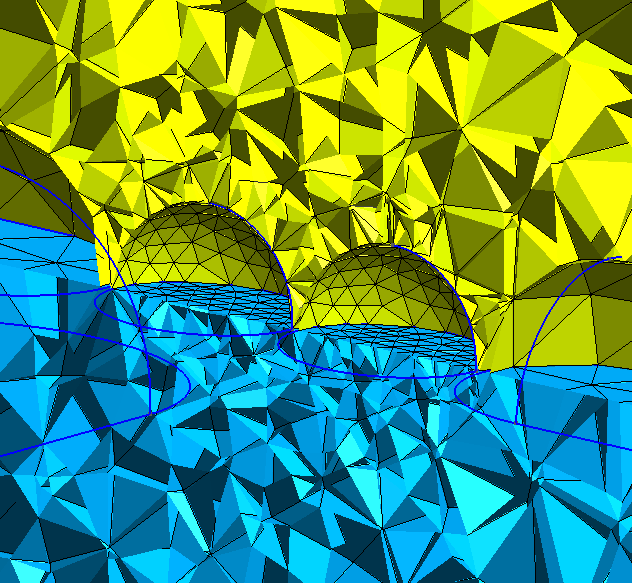
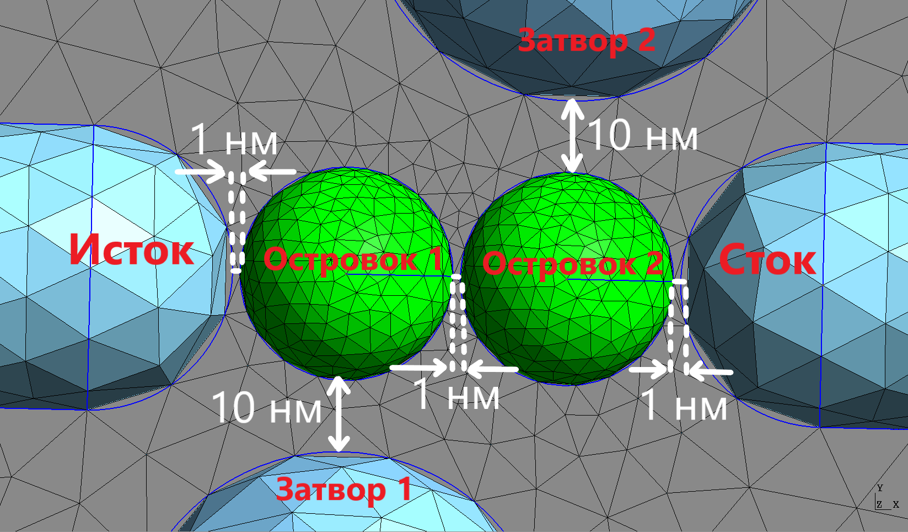

Феральное государственное бюджетное общеобразовательное учреждение
высшего образования\<\< Московский государственный университет имени
М.В. Ломоносова\>\>

Курсовая работа

Расчет емкостных параметров для одноэлектронных систем с большим
количеством островов и электродов

Студент\
Латышов Кирилл Владимирович.\
Научный руководитель\
кандидат физико-математических наук\
Шорохов Владислав Владимирович

Москва -- 2024

Введение {#введение .unnumbered}
========

**[Актуальность работы]{.underline}**

В элементах полупроводниковых квантовых компьютеров с большим числом
кубитов необходимо большое число туннельных и управляющих электродов, а
также большое количество островков. Причём, изменение взаимного
расположения этих элементов координально меняет транспортные, зарядовые,
спиновые и временные характеристики устройства, а также влияет на
качество его работы. Так как изготовление реальных образцов с
определенным расположением элементов является очень долгой и
дорогостоящей процедурой, необходимо производить предворительный расчёт
интересующих транспортных характеристик реализуемого устройства.
Численное моделирование позволит быстро менять расположение элементов,
добавлять новые составляющие устройства, а также подбирать их
оптимальную форму и размер, благодаря чему в последствии можно будет
изготовить устройство с максимальным временем квантовой когерентности и
квантовой достоверности для выполнния квантовых операций. В связи с
этим, данная работа является десйствительно актуалной.

**[В работе поставлены следующие цели:]{.underline}**

-   Разработать численный метод расчета распределения электрических
    полей для систем, состоящих из металлических электродов и наведённых
    квантовых точек.

-   Разработать метод расчета матриц электростатической индукции и
    электрических ёмкостей для системы электродов и наведённых квантовых
    точек.

-   Для полученной матрицы ёмкостей научится определять изменение
    электростатической энергии всей системы в процессе переноса
    электронов между электродами и квантовыми точками, а также между
    квантовыми точками.

Обзор литературы {#обзор-литературы .unnumbered}
================

Нахождение матрицы электростатической индукции и матрицы электрических
ёмкостей подразумевает под собой нахождение напряженности поля $Е$ и
потенциала $\phi$ -- по заданным величинам и распределению зарядов в
пространстве окружающем электроды и наведённые квантовые точки, включая
те части протсранства, которые заполнены диэлектриком и
полупроводниками. Это можно осуществить путем решения уравнения
Пуассона: $$\label{eq1}
    \Delta \phi = -\frac{4\pi}{\epsilon}\rho.$$ Тут $\phi$ - потенциал
поля, $\epsilon$ - диэлектрическая проницаемость среды, $\rho$ -
объемная плотность заряда в рассматриваемом объеме. В данной работе
производится численное решение уравнения
[\[eq1\]](#eq1){reference-type="ref" reference="eq1"} при помощи
трёхмерного метода конеченых элементов с элементами в виде тетраэдоров.

**[Метод конечных элементов]{.underline}** основывается на построении
приближённого решения дифференциального уравнения. Рассматривается
задача поиска решения дифференциального уравнения в частных производных
вида; $$\label{eq2}
    \begin{cases}
    Lu = f
    \\
    (Au + Bu'|_{\Sigma} = g_0,
    \\
    \end{cases}$$ где $L$ - дифференциальный оператор, $u$ - искомая
функция, $f$ - неоднородность уравнения, $А$ и $В$ - постоянные
коэффициенты, $\Sigma$ - граница области, в которой ищется решение,
$g_0$ - функция, задающаяя граничное условие.

Задача ([\[eq1\]](#eq1){reference-type="ref" reference="eq1"})
эквивалентна задаче поиска минимума функционала $I[u]$: $$\label{eq2}
    \begin{cases}
    I[v] = 2(f, v) - (Lv, v) -> min 
    \\
    (Au + Bu')|_{\Sigma} = g_0,
    \\
    \end{cases}$$ где $v$ - пробная функция, $(f, v)$ и $(Lv, v)$ -
скалярные произведения вида $(a, b) = \int_{\Sigma} a(q)b(q) \, dq$, $q$
- совокупность всех переменных, от которых зависят функции.

Область, в которй ищется решение разбивается на конечное число
элементов. В двумерном случае это как правило треугольники, а в
трехмерном - тетраэдеры. В каждом из элементов выбирается вид
аппроксимирующей функции. В простейшем случае - это полином первой
степени, но можно брать, например, спецфункции или сплайны. Вне своего
элемента эта функция равна нулю, а её значение в узле обычно берут
равным еденице. Искомое приближенное решение записывается в виде
разложения в ряд по фыбранным аппроксимрирующим функциям
([\[eq3\]](#eq3){reference-type="ref" reference="eq3"}). $$\label{eq3}
    v^h(q) = \sum_{j = 1}^Nq_j\phi_j(q),$$ где $N$ - число конечных
элементов, $h = \frac{1}{N}$. Неизвестными являются занчения
коэффициентов разложения $q_j$, их необходимо найти.

Коэффициенты разложения ищутся из условия минимума функционала $I[v^h]$,
который в матричной форме записывается в виде: $$\label{eq4}
    I[v^h] = q^TKq-2F^Tq,$$ где $\Vec{q^{T}} = (q_1, ..., q_N)$ - вектор
коэффициентов разложения, $K$ - матрица жесктости, получаеющаяся при
подстановке приближенного решения в вариационную задачу
([\[eq2\]](#eq2){reference-type="ref" reference="eq2"}). $F$ - матрица
неоднородности получаеющаяся при подстановке приближенного решения в
вариационную задачу ([\[eq2\]](#eq2){reference-type="ref"
reference="eq2"}). В монографии [@book4] показанно, что минимизация
функционала $I[v^h]$ происходит на векторе $Q$, таком, что $$\label{eq5}
    KQ = F,$$ Таким образом находятся коэффициенты разложения.

[Преимуществами]{.underline} метода конечных элементов являются:

-   Произвольная форма обрабатываемой области.

-   Возможность сгущения сетки в необходимых местах области.

-   Возможность задания различных параматеров для разных подобластей.

[Недостатком]{.underline} метода метода конченых элементов можно
назваать сложность его реализации по сравнению с, например, методом
коненчых разностей на регулярных сетках. Это невелируется тем, что
сегодня уже существуют готовые библиотеки предоставляющие возможность
решать различные дифференциальные уравнения при помощи данного метода.

**[Расчёт ёмкостных параметров элементов]{.underline}** Связь между
зарядами и потенциалами в системе из $n$ проводников, как показанно в
монографии [@book5], имеет вид: $$\label{eq6}
    \begin{cases}
        Q_1 = C_{11}U_1+C_{12}(U_1-U_2)+...+C_{1n}(U_1-U_n)
        \\
        Q_2 = C_{21}(U_2-U_1)+C_{22}U_2+...+C_{2n}(U_2-U_n)
        \\
        ...
        \\
        Q_n = C_{n1}(U_n-U_1)+C_{n2}(U_n-U_2)+...+C_{nn}U_n,
    \end{cases}$$ где $Q_i$, $U_1$ -заряд и потенциал i-го проводника (i
= 1, 2, \..., n); $C_{ii}$ - собственная частичная ёмкость i-го
проводника; $C_{ik}$ - взаимная частичная ёмкость между i и k-м
проводниками ($i, k = 1, 2, ..., n); i \neq k$, при этом
$C_{ik} = C_{ki}$.

Метод реализации алгоритма рассчёта {#метод-реализации-алгоритма-рассчёта .unnumbered}
===================================

Для реализации алгоритма был использован язык программирования С++,
также были использованы следующие открытые и общедоступные программные
библиотеки:

-   GMSH -- это генератор трёхмерных сеток конечных элементов с открытым
    исходным кодом, со встроенным модулем
    САПР$\footnote{САПР - система автоматизированного проектирования, позволяющая создавать графические модели при помощи компьютерных программ.}$.
    GMSH предоставляет быстрый, легкий и удобный инструмент для создания
    сетки с параметрическим вводом и гибкими возможностями визуализации.

-   MFEM -- это бесплатная и масштабируемая библиотека для C++ для
    реализации метода конечных элементов.

-   GLVis -- это инструмент для точной и гибкой визуализации методом
    конечных элементов. Цель GLVis --- обеспечить возможность
    исследования и разработки общих алгоритмов дискретизации методом
    конечных элементов посредством точной визуализации при помощи
    OpenGL$\footnote{OpenGL (Open Graphics Library) — библиотека, определяющая платформонезависимый (независимый от языка программирования) программный интерфейс для написания приложений, использующих двумерную и трёхмерную компьютерную графику.}$
    и тесной интеграции с библиотекой MFEM.

-   EIGEN - это библиотека шаблонов C++ для линейной алгебры,
    реализующая такой инструментарий как работа с матрицами и векторами.

**[Генерация сетки. Модель одноэлектронного транзистора.]{.underline}**

На первом этапе было выполнено создание сетки для модели
одноэлектронного транзистора (см. Рис. [1](#fig:1){reference-type="ref"
reference="fig:1"}). В качестве модельных параметров использовались (см.
Рис [2](#fig:2){reference-type="ref" reference="fig:2"}):

[Модельные параметры островка]{.underline}

-   Радиус островка: $r$ = 15 нм.

[Модельные параметры электродов]{.underline}

-   Радиус окончаний стока и истока: $R_{el}$ = 20 нм;

-   Расстояние между островком и стоком и истоком: $d$ = 1 нм;

-   Радиус затворов: $R_{gate}$ = 30 нм;

-   Расстояние между островком и затворами: $D$ = 10 нм.

{#fig:1 width="80%"}

{#fig:2 width="100%"}

Для создания сетки был использован модуль Open CASCADE[^1]. Благодаря
этому появилась возможность использования конструктивной сплошной
геометрии. Это позволило построить сложную структуру объектов, используя
простейшие геометрические тела (примитивы), такие как куб, цилиндр,
сфера и так далее.

В данной работе островок задаётся как полусфера. Элеткроды представляют
собой объединение цилиндра, обрезанного на пополам вдоль вертикальной
оси, с четвертью сферы, выступающей в качестве окончания электрода.
Диэлектрическая подложка задаётся как вертикальный цилиндр с элипсом в
основании, а окружающая среда предстваляется как половина элипсоида,
плоскость которого свопадает с поверхностью подложки (См. Рис.
[1](#fig:1){reference-type="ref" reference="fig:1"}). В области вблизи
острова задётся сгущение сетки для того, чтобы получить более подробное
решение вблизи интересующей нас области. При приближении к границам
моделируемой области сетка становится более разреженной (См. Рис.
[3](#fig:6){reference-type="ref" reference="fig:6"}).

{#fig:6
width="90%"}

**[Генерация сетки. Модель одноэлектронного пампа.]{.underline}**

Аналогично генерируется сетка и для модели одноэлектронного насоса
(островки абсолютно одинаковые) (см. Рис.
[4](#fig:3){reference-type="ref" reference="fig:3"}). В качестве
модельных параметров использовались (см. Рис.
[5](#fig:4){reference-type="ref" reference="fig:4"}):

[Модельные параметры островков]{.underline}

-   Радиус островков = 15 нм.

-   Расстояние между островками = 1 нм;

[Модельные параметры электродов]{.underline}

-   Радиус стока и истока = 20 нм;

-   Расстояние между каплями и стоком и истоком = 1 нм;

-   Радиус затворов = 30 нм;

-   Расстояние между каплями и затворами = 10 нм.

Дальнейший расчёт ёмкостных параметров будет производится именно для
этой модели.

{#fig:3 width="100%"}

{#fig:4
width="100%"}

**[Решение задачи нахождения распределения электрического
поля]{.underline}** **[методом конечных элементов.]{.underline}**

При помощи библиотеки MFEM было реализованно программное обеспечение,
решающее уравнение Пуассона для переданной в неё сетки, граничных
условий и параметров областей (например, диэлектрическая проницаемость
среды). Для того, чтобы рассчитать ёмкостные параметры элементов
устройства на осровки и электроды подавались различные потенциалы,
которые выбирались из соображений обнуления некоторых слагаемых в
выражении ([\[eq6\]](#eq6){reference-type="ref" reference="eq6"}). Так
например, если мы хотим рассчитать собственные ёмкости островков и
электродов, задаём на них всех потенциал равный $1$ В. Получим
([\[eq11\]](#eq11){reference-type="ref" reference="eq11"}).
$$\label{eq11}
    \begin{cases}
        Q_1 = C_{11}*1\ В+C_{12}*(1\ В-1\ В)+...+C_{1n}*(1\ В-1\ В)
        \\
        Q_2 = C_{21}*(1\ В-1\ В)+C_{22}*1\ В+...+C_{2n}*(1\ В-1\ В)
        \\
        ...
        \\
        Q_n = C_{n1}*(1\ В-1\ В)+C_{n2}*(1\ В-1\ В)+...+C_{nn}*1\ В,
    \end{cases}$$ Откуда сразу получаем, что: $$\label{eq12}
    \begin{cases}
         C_{11} = Q_1/1\ В
        \\
        C_{22} = Q_2/1\ В
        \\
        ...
        \\
        C_{nn} = Q_n/1\ В
    \end{cases}$$ Далее рассчитывалось напряженность электрического
поля. Затем при попмощи теоремы Гаусса считался заряд элементов
устройства. И в итоге, по известным значениям заряда и потенциала
элемента рассчитывалась ёмкость.

Пример расчета матрицы электростатической индукции и зарядовой энергии островков {#пример-расчета-матрицы-электростатической-индукции-и-зарядовой-энергии-островков .unnumbered}
================================================================================

**[Рассчет матрицы электростатической индукции.]{.underline}**

Для того, чтобы определить собственные ёмксоти проводников нужно задать
потенциал на каждом проводнике равным одному вольту. В таком случае
$C_{ii} = \dfrac{Q_i}{U_i}$. Чтобы посчитать взаимную ёмкость между i-м
и j-м проводниками нужно задать на всех проводниках кроме j-го потенциал
равный нулю, а $U_j = -1 В$. В таком случае
$\forall \ i \neq j: \ C_{ij} = \frac{Q_i}{U_j}$. Далее, согласно
монографии [@book5], для рассчета матрицы электростатической индукции
используем следующие формулы: $$\label{eq7}
    \begin{cases}
        \beta_{kk} = C_{k1}+C_{k2}+...+C_{kn}
        \\
        \beta{ik} = -C_{ik}
    \end{cases}$$ Для модели одноэлектронного пампа рассчитанная матрица
электростатической индукции имеет вид (размеры элементов указаны выше:

$\hat{\beta}=$

$=$

29.3 & −9.1 & −9.9 & −0.6 & −4.5 & −2.9\
−9.1 & 28.9 & −0.6 & −9.5 & −2.9 & −4.7\
−9.9 & −0.6 & 57.6 & −0.6 & −7.7 & −3.7\
−0.6 & −9.5 & −0.6 & 56.8 & −3.7 & −7.8\
−4.5 & −2.9 &−7.7&−3.7 & 66.5& −1.4\
−2.9&−4.7&−3.7&−7.8& −1.4&66.8\

Проведённые рассчёты имеют предварительный характер. **[Рассчет
зарядовой энергии.]{.underline}**

Зная матрицу электростатической индукции, можно рассчитать зарядовую
энергию рассматриваемой двухострвоковой системы. Для этого возьмем часть
матрицы электростатической индукции, связанную с отровками
([\[eq8\]](#eq8){reference-type="ref" reference="eq8"}). А также возмем
вектор нескомпенсированных зарядов на островке
([\[eq9\]](#eq9){reference-type="ref" reference="eq9"}). $$\label{eq8}
    \hat{\beta}_{0} = \begin{pmatrix}
\beta_{11}&\beta_{12}\\
\beta_{21}&\beta_{22}
\end{pmatrix}$$ $$\label{eq9}
    Q^T = (n_1e, n_2e),$$ тут $n_1$ и $n_2$ - чилсо нескомпенсированных
зарядов на первом и втором острвках соответсвтенно.

Далее считаем зарядовую энергию ([\[eq10\]](#eq10){reference-type="ref"
reference="eq10"}). $$\label{eq10}
    U_{з.э.} = \frac{Q^T\hat{\beta}^{-1}Q}{2}$$

Ниже приведён график полученной зависимости зарядовой энергии от числа
нескомпенсированных зарядов на островках.

{#fig:5 width="90%"}

Итоги работы {#итоги-работы .unnumbered}
============

**[Полученные результаты.]{.underline}**

-   Разработана программа построения трёхмерных нерегулярных сеток для
    моделирования различных трехмерных одноэлектронных структур;

-   реализован алгоритм расчета электрических полей для трехмерных
    одноэлектронных структур максимально приближённых к
    эксперементальным;

-   реализован алгоритм, рассчитывающая ёмкостную матрицу
    одноэлектронной структуры по заданному распределению поля;

-   произведены рассчёты электростатической энергии сложной
    одноэлектронной структуры, соответсвующей реальной эксперементальной
    структуре.

**[Планы на будущее.]{.underline}**

-   Приблизить модель к реальным структурам путём задания электродов не
    элементарными геометрическими фигурами, а при помощи би-сплайнов
    сложной формы (змейки, петли, кроссбары);

-   применить методы машинного обучения для получения оптимальных
    параметров наведённых квантовых точек;

-   осуществить моделирование работы однокубитного и двухкубитного
    квантового полупроводникового устройства.

00 P. L. Bavdaz, H. G. J. Eenink, J. van Staveren, M. Lodari, C. G.
Almudever J. S. Clarke, F. Sebasatiano, M. Veldhorst, & G. Scappucci
,$"$A quantum dot crossbar with sublinear scaling of interconnects at
cryogenic temperature$"$, npj Quantum Information, 2022. Akito Noiri,
Kenta Takeda, Takashi Nakajima, Takashi Kobayashi, Amir Sammak, Giordano
Scappucci & Seigo Tarucha., $"$A shuttling-based two-qubit logic gate
for linking distant silicon quantum processors$"$, Nature
Communications, 2022. Zahid Ali, Khan Durrani, $"$Single-Electron
Devices and Circuits in Siliconr$"$, 2010. Стренг Г., Фикс Дж.,
$"$Теория метода конечных элементов$"$, 1977. Ю. Я. Иоссель, Э. С.
Кочанов, М. Г. Струнский, $"$Расчет электрической емкости$"$, 1981.

[^1]: Open CASCADE Technology (OCCT) --- полномасштабная библиотека
    трехмерной геометрии с открытым исходным кодом. Является ядром САПР.
